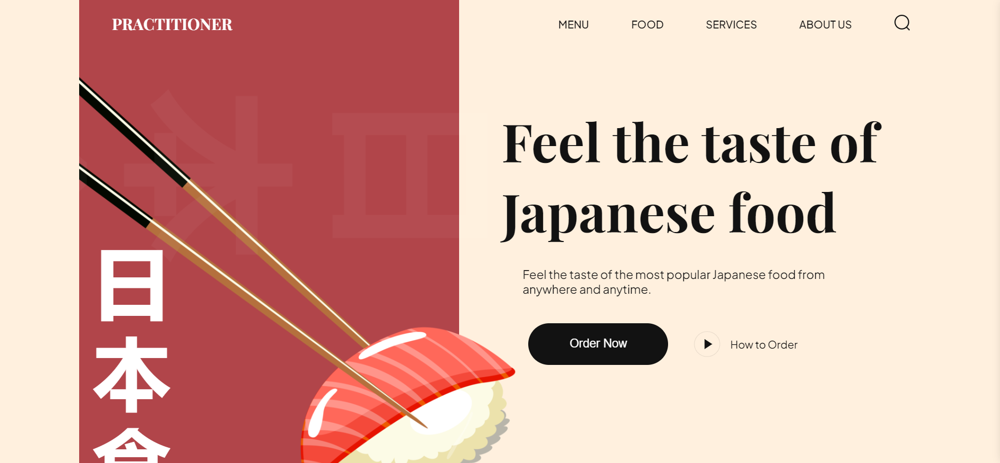

## Practitioner Sushi Website



Welcome to the Practitioner Sushi website project! This dynamic and responsive website is designed to offer users a delightful browsing experience, showcasing a variety of sushi dishes. This project is a testament to our collaborative efforts and skills in modern web development.

### 💭 Process

Our journey began with understanding the requirements and drafting a plan to implement the features using modern web technologies. We divided tasks among the team members, ensuring each member focused on a specific section of the project through unique branch names. This approach fostered synergy and efficient collaboration.

We encountered challenges such as merge conflicts while working with Git and GitHub, but these experiences taught us valuable lessons in version control and collaborative development.

👥 **Fostering Collaborative Development**:
This project underscores the essence of collaborative development. Each team member contributes through unique branch names, ensuring focused efforts on different project sections, fostering synergy and a harmonious blend of individual expertise towards a common goal.

#### Meet the Team:

- **G M Lalithdharan** - [LinkedIn](https://www.linkedin.com/in/lalithdharan/)
- **Vignesh M** - [LinkedIn](https://www.linkedin.com/in/vignesh-m2004/)
- **Guna Palanivel** - [LinkedIn](https://www.linkedin.com/in/guna-palanivel/)
- **Mukund P U** - [LinkedIn](https://www.linkedin.com/in/mukund-p-u-42b74224a/)

### 🔍 Figma Design and Deployment:

- [Project Repository](https://github.com/GunaPalanivel/practitioner-sushi.git)
- [Live Deployment](https://practitioner-sushi.vercel.app/)
- [Figma Design](https://www.figma.com/design/DSil0rrsV0HRV0U9bKP39j/practitioner-sushi?node-id=0-1&t=lLVrzgLwvGVrfFMA-1)

### 📚 Learnings

- Effective use of CSS variables and modular CSS imports.
- Implementation of responsive layouts using flex and position properties.
- Enhanced JavaScript skills through dynamic HTML rendering.
- Importance of smooth animations for user experience.
- Adherence to the BEM methodology for maintainable code.
- Maintaining a well-organized file and folder structure.

### ✨ Improvement

While the project turned out well, there is always room for improvement. Future enhancements could include:

- Further optimization of JavaScript code for performance.
- Adding more interactive features to enhance user engagement.
- Conducting more thorough user testing to identify and fix usability issues.

### 📦 Tech Stack

- **HTML 5**
- **CSS 3**
- **JavaScript**
- **Vite**

### 👩🏽‍🍳 Features

- **CSS Variables**: Maintain consistent styling throughout the project with easily adjustable variables.
- **Modular CSS Imports**: Promote organized and modular styling by importing CSS files into other CSS files.
- **Flex and Position Properties**: Utilize CSS flex and position properties for responsive and well-structured layouts.
- **JavaScript HTML Rendering**: Enhance code efficiency by rendering HTML through reusable JavaScript functions.
- **Smooth Animations**: Provide a seamless user experience with smooth and subtle CSS animations.
- **BEM Methodology**: Use the Block Element Modifier (BEM) methodology for clear and maintainable class naming.
- **Organized File Structure**: Ensure easy navigation and management of project assets with a well-organized file and folder structure.
- **Responsive Design**: Guarantee a responsive experience across all devices using media queries and fluid layouts.

### 🚦 Running the Project

To run the project locally on your machine, follow these steps:

#### Prerequisites

Ensure you have the following installed:

- Git
- Node.js
- npm (Node Package Manager)

#### Cloning the Repository

```bash
git clone https://github.com/GunaPalanivel/practitioner-sushi.git
```

```bash
cd practitioner-sushi
```

#### Installation

Install the project dependencies using npm:

```bash
npm install
```

```bash
npm install aos
```

#### Running the Project

Start the development server:

```bash
npm run dev
```

Open [http://localhost:5173](http://localhost:5173) in your browser to view the project.

💡 **Upcoming Project Teaser**:
Our team is excited to embark on a new endeavor—a dynamic sushi website! We're set to employ cutting-edge techniques, including CSS Variables, Flex and Position properties, smooth animations, and the BEM methodology, promising a seamless user experience.

## Contributing

We welcome contributions from the community to make this project even better! To get started, please follow these steps:

1. **Fork the Repository**: Click the "Fork" button at the top right corner of this page to create a copy of the repository in your GitHub account.
2. **Clone Your Fork**: Clone your forked repository to your local machine.

   ```bash
   git clone https://github.com/your-username/practitioner-sushi.git
   ```

   ```bash
   cd practitioner-sushi
   ```

3. **Create a New Branch**: Create a new branch for your feature or bug fix.

   ```bash
   git checkout -b feature-branch
   ```

4. **Make Your Changes**: Implement your changes or additions in the new branch.

5. **Commit Your Changes**: Once your changes are ready, commit them with a descriptive message.

   ```bash
   git commit -m "Add [feature/bug description]"
   ```

6. **Push to Your Branch**: Push the committed changes to your forked repository.

   ```bash
   git push origin feature-branch
   ```

7. **Open a Pull Request**: Navigate to the original repository and open a pull request (PR) from your forked repository. Be sure to provide a clear description of the changes you have made and any additional context that might be helpful for the reviewers.

### Guidelines for Contributing

- **Write Clear Commit Messages**: Use clear and concise commit messages that accurately describe the changes made.
- **Code Style**: Ensure your code follows the project's style guidelines and best practices.
- **Documentation**: Update the documentation if your changes include new features or significant modifications.
- **Tests**: If applicable, write tests for your changes to ensure functionality is maintained and new features work as expected.

### Reviewing and Merging Pull Requests

All contributions will be reviewed by the project maintainers. Feedback and suggestions for improvements may be provided during the review process. Once your pull request has been reviewed and approved, it will be merged into the main branch.

We appreciate your contributions and thank you for helping improve this project!

If you have any questions or need further assistance, feel free to reach out to us by opening an issue in the repository.

Let's continue pushing boundaries and crafting exceptional web experiences together! 💻✨

## License

This project is licensed under the MIT License - see the LICENSE file for details.
